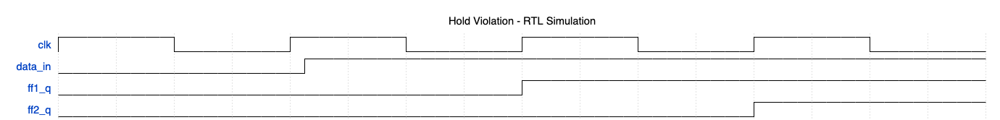
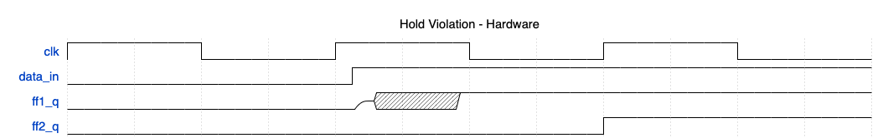

# Dynamic CDC Metastability Injection Model

This repository provides an open-source SystemVerilog model for simulating [metastability](https://en.wikipedia.org/wiki/Metastability_(electronics)) in designs containing Clock Domain Crossings (CDCs). The primary goal is to dynamically verify the validity of the design's synchronization schemes by injecting realistic metastability events during simulation.

The model is implemented with flexibility, scalabilitity, and performance in mind; it has minimal impact on simulation time and can be configured without recompilation, making it suitable for large designs.

The model is distributed under the permissive MIT License.

## Table of Contents

* [Introduction](#introduction)
  * [Effects of Metastability](#effects-of-metastability)
* [Design Philosophy](#design-philosophy)
* [Simulation Control (Plusargs)](#simulation-control-plusargs)
* [Benchmarking](#benchmarking)
* [Getting Started](#getting-started)
  * [How to Run a Simulation](#how-to-run-a-simulation)
* [Release History](#release-history)

## Introduction

The goal of Dynamic CDC is twofold: to ensure that the post-synthesis (silicon) synchronizers behave the same as in simulation by verifying that the design functions correctly under varying synchronization latencies caused by metastability, and to verify that clock domain crossings with synchronizers are synchronized with viable methods. 

While Static CDC performs a structural analysis of the design's RTL and identifies potential CDC issues (like missing synchronizers, reconvergence, or glitches) without running a simulation, Dynamic CDC  focuses on exercising these crossings by "dynamially" running simulation.

Dynamic CDC is often ran on top of Static CDC, with the goal of detecting functional bugs that Static CDC may miss. In particular, Static CDC relies on human written constraints, which can be (and often are) implemented incorrectly; Dynamic CDC being simulation-based, operates on the functional behavior of the RTL under stimuli that stress CDC paths.

For example: if a path was incorrectly declared a false_path in Static CDC, the dynamic simulation will show the functional impact of metastability. This could manifest as incorrect data values, where the receiving logic samples an unstable value leading to a wrong result, or functional failures, where a state machine may enter an illigal state, etc.

These are bugs that the static tool operating under faulty constraints would have not flagged.

### Effects of Metastability

For the purposes of Dynamic CDC, metastability occurs when a flip-flop undergoes a either a [setup or hold violation](https://vlsiuniverse.blogspot.com/2017/02/setup-and-hold-violations.html).

To best explain the reason for metastability modeling, consider how setup and hold violations are interpreted in simulation:

Setup Violation in Simulation:


Hold Violation in Simulation:


For pure RTL, the simulator has no way of knowing when a setup or hold violation occures; this means that the behavior of synchronizers in RTL simulation is different than in physical hardware, due to the fact that metastability does not occur by default in simulation.

Therefore, in simulation a positive edge triggered two D Flip-Flop (2DFF) synchronizer will always exhibit a synchronization latency (number of triggering edges of destination clock before signal is seen at output) of 2 positive clock edges. In reality, this is not always the case. Consider the following scenarios:

Setup Violation in Hardware:

In this example, the metastable FF settles to the old value, resulting in a 3 cycle synchronization latency. If the FF settled to the new value, the synchronization latency would be 2 cycles.

Hold Violation in Hardware:

In this example, the metastable FF settles to the new value, resulting in a 1 cycle synchronization latency. If the FF settled to the old value, the synchronization latency would be 2 cycles.

__Due to metastability, it is possible for a 2DFF synchronizer to experience synchronization latencies of 1 or 3 positive clock edges.__ This effect needs to be manually modeled.

## Design Philosophy
The `sync_2dff.sv` model consists of a 2DFF synchronizer with an internal `metastability_injector.sv` and `glitch_monitor.sv`.

The model is designed with the following features in mind:

__2DFF as the foundation:__ The 2DFF synchronizer is the fundamental building block for all synchronization schemes: FIFO's, handshaking, etc. More complex synchronizers still rely on 2DFF synchronizers for control signals, which is why metastability needs to be modeled in the 2DFF. The intent is to use the `sync_2dff.sv` model when building these more complex synchronizers.

__Repeatable and unique randomization__: for each instance of metastability injectors. Done via hierarchichal seeding with a Linear-Feedback Shift register (`lfsr_8bit.sv`) instantiated in the `metastability_injector.sv`. Results in completely reproducible simulations which are vendor agnostic, since randomization is performed without calls to $urandom.

__No recompilation on configuration:__ No recompilation is needed for global or hierarchichal enabling of metastability modeling. All configuration (except synthesizability) is done dynamically at runtime via plusargs.

__Fast Simulation Speed__: Low overhead introduced from metastability modeling (see [Benchmarking](#benchmarking)). Integration into large design verification flows with large number of synchronizers causes negligible increases in simulation times.

__Pessimism__: The model aims to be as pessimistic as possible, _without introducting false positives_. In particular, special care is taken to avoid filtering of valid data, meaning valid transitions (held constant for 1 destination domain cycle) will be seen at the output of the synchronizer.

__Vendor Agnosticism__: The model should work with _and behave the same on_ all comercial simulators and Verilator.

## Simulation Control (Plusargs)
The model's behavior can be configured at runtime using SystemVerilog plusargs. This eliminates the need for recompilation when adjusting simulation parameters.

* `+global_metastability_enable=<0|1>`: A global switch to enable (1) or disable (0) metastability injection across the entire design.
* `+metastability_hierarchy_toggle=<comma_separated_hierarchies>`:
  * A comma-separated string of hierarchical paths (or parts of paths) that will toggle the metastability injection for specific instances.
  * The interpretation of this depends on `+global_metastability_enable`:
    * If `+global_metastability_enable=1` (default): Metastability injection is **enabled globally**, and instances matching one of the provided `hierarchy_toggle` patterns will have metastability **disabled**.
    * If `+global_metastability_enable=0`: Metastability injection is **disabled globally**, and only instances matching one of the provided `hierarchy_toggle` patterns will have metastability **enabled**.
  * Supports `*` as a wildcard for any hierarchical level or part of a name.
  * Examples:
    * `+metastability_hierarchy_toggle=testbench.dcdc_sync_2dff` (Matches a full path)
    * `+metastability_hierarchy_toggle=*.my_module.sync_inst` (Wildcard for top levels)
    * `+metastability_hierarchy_toggle=sync_top.*` (Wildcard for sub-instances)
* `+metastability_seed=<value>`: TODO
* `+random_metastability_seed`: TODO
* `+metastability_probability=<value>`: Sets the probability (0-100) of a metastability event occurring when conditions are met. A value of 100 means metastability will always be injected __when possible__.

### Usage with Verilator

Plusargs can be passed directly to the Verilator executable (i.e. Vtestbench). For example, to seed the metastability-generation random number generator and disable all synchronizers in instance top.module1:

```bash
./obj_dir/Vtestbench +metastability_seed=432 +global_metastability_enable=1 +metastability_hierarchy_toggle=top.module1
```
## Benchmarking

This section benchmarks the performance impact of enabling the `sync_2dff.sv` model and its features. Benchmarking is done using `tb/benchmark_tb.sv`, in which 64 `sync_2dff` synchronizers are instantiated and ran for 100,000,000 clock cycles. The benchmarking is performed on an M1 Macbook Air (8GB RAM) and is ran with the `time` command. The following parameters are tested:

- **Synthesis (`SYNTHESIS`)**: Makes synchronizer synthesizable. Disables Dynamic CDC modeling and Glitch Monitor.
- **Glitch Monitor (`ENABLE_GLITCH_MONITOR`)**: Performance implications of activating the glitch detection mechanism.

| Feature Enabled      | Simulation Time (seconds) | Notes |
|---------------------------|---------------------|-------|
| Synthesis (Baseline) | 30.5      | Basic 2DFF synchronizer `SYNTHESIS=1` |
|  Metastability Only | 32.9 | `SYNTHESIS=0 ENABLE_GLITCH_MONITOR=0` |
|  Metastability + Glitch Monitor | 33.1 | `SYNTHESIS=0 ENABLE_GLITCH_MONITOR=1` |

Enabling the metastability model and glitch detector results in an __8.5% increase in simulation time__ when compared to a baseline 2DFF synchronizer with no metastability modeling.

## Getting Started
The model and all of its components are located in the `src` folder.

### Verilator
This project uses [Verilator](https://www.verilator.org/) for compilation and simulation. Ensure you have Verilator installed and configured on your system.

* **Installation:** Follow the instructions on the [Verilator website](https://www.verilator.org/guide/latest/install.html). Typically, this involves:
    ```bash
    # For Ubuntu/Debian:
    sudo apt-get install verilator
    # For Fedora/RHEL:
    sudo dnf install verilator
    # For macOS (with Homebrew):
    brew install verilator
    ```
    Or build from source for the latest version.

## How to Run a Simulation
An example Makefile and testbench is provided. To run a test simulation and see the model and action, ensure you have Verilator and a waveform viewer installed and simply run 
  ```bash
  make
  ```

A resulting `waves.vcd` file will be created.

## Release History
| Version   | Date       | Summary                                  |
|-----------|------------|------------------------------------------|
| `v0.1`    | 2025-Jul-01 | Initial release.                  |
